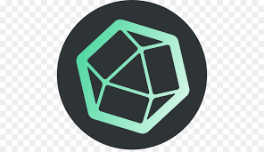

</img>
### Hi there,👋 How are you doing?

### :space_invader: &nbsp;About Me

- 🧑‍💻  Currently working as a **Software Developer** at [Amdocs](https://www.amdocs.com/) 
- 🔭 I’m currently working on **personal growth**
- 🌱 I’m currently learning so many things🤣 
- 👯 I’m looking to collaborate on freelancing python projects.
- 💬 Ask me about development and investment.
- ⚡ Fun fact: I love to play badminton and chill with friends.

### Languages and Tools:
&nbsp;
&nbsp;
&nbsp;

  
<b>📈&nbsp;GitHub Stats</b>

   

<!-- &hide=stars,commits,prs,issues,contribs -->
  
     

<!-- ?hide=language1,language2 -->

### Connect with me:

  

 &nbsp;&nbsp;<em><b>I love connecting with different people, so if you want to say '**Hi**' I'll be more happy to talk!</b>😃</em>
  

